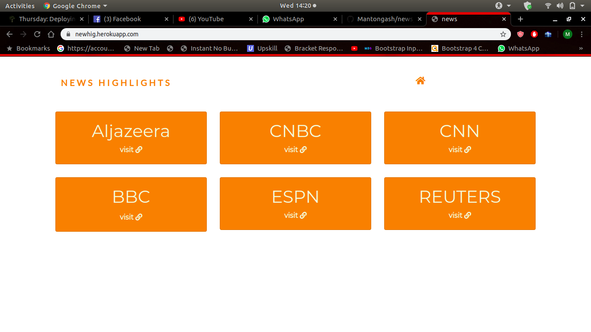

#                Pass Locker

An application that aloows user to view the current news headlines from across different sources.

## Created by [wamakimaN](https://github.com/wamakimaN)

## Description

It allows users to see the most recent and important news.
Users select the source they want to use and are taken to  apage with the news from tha source.
Users have the option of reading the full article inside the source website.

## B.D.D

* landing page

* Example of a news source page.

---

|  Behaviour 	|  Input 	|  Output 	|
|---	|---	|---	|
| Choose a news source  	|   Click on "visit" on the source you want   	|  user is directed to a page with the highlighted news for that source 	|
|   Read an article of choice 	|   click on "read article"  	|   user is redirected to the source website of the article   |
|   Go back to Landing page    |    Click on the home icon or "News Highlights"    |    user is taken back to landing page where they can select another source.     |

## link

You can use the app [here](https://newhig.herokuapp.com/)

## Installation

Clone this using the command below on your terminal:

$ git clone  https://github.com/wamakimaN/movie-list.git

## Technologies Used

* Python 3.6
* Dependencies :
astroid==2.3.3
autopep8==1.4.4
certifi==2019.11.28
chardet==3.0.4
Click==7.0
dominate==2.4.0
Flask==1.1.1
Flask-Bootstrap==3.3.7.1
Flask-FontAwesome==0.1.2
gunicorn==20.0.4
idna==2.8
isort==4.3.21
itsdangerous==1.1.0
Jinja2==2.10.3
lazy-object-proxy==1.4.3
MarkupSafe==1.1.1
mccabe==0.6.1
newsapi-python==0.2.6
pycodestyle==2.5.0
pylint==2.4.4
requests==2.22.0
six==1.13.0
typed-ast==1.4.0
urllib3==1.25.7
visitor==0.1.3
Werkzeug==0.16.0
wrapt==1.11.2

## Known bugs

there are no known bugs at the moment.

## License

MIT (C) **[wamakimaN](https://github.com/wamakimaN)**